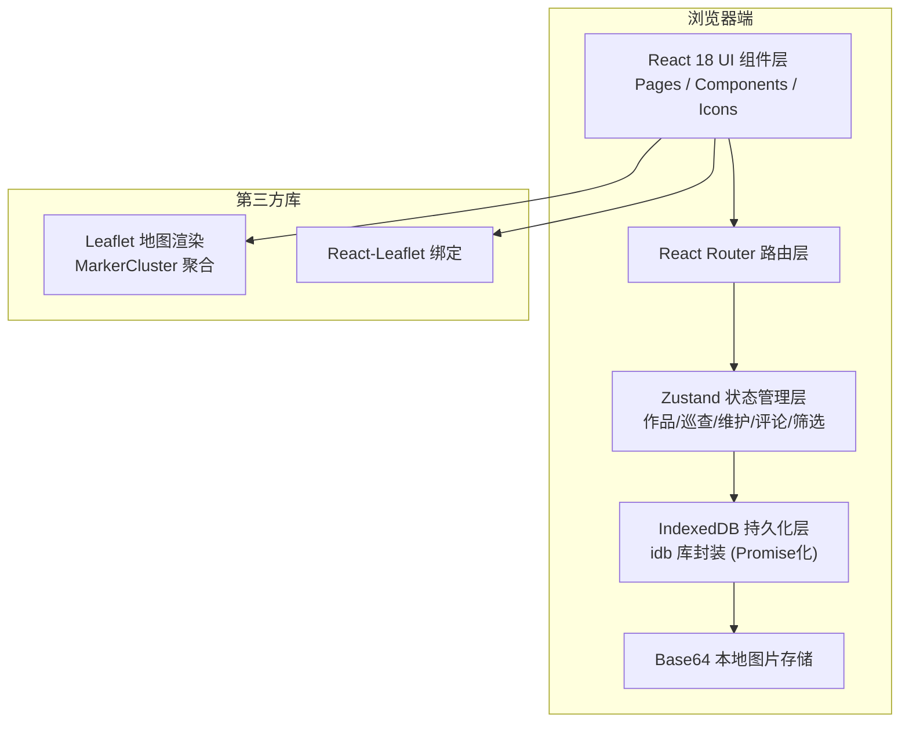

## 1. 架构设计



## 2. 技术说明

- 前端框架：React@18 + TypeScript@5 + Vite@6
- UI样式：Tailwind CSS@3 + 自定义主题色（Teal + Amber + Slate）
- 路由：react-router-dom@7
- 状态管理：zustand@5
- 地图渲染：leaflet + react-leaflet + leaflet.markercluster
- 本地数据库：IndexedDB（通过idb库Promise封装）
- 图表：纯CSS/SVG轻量实现（饼图/柱状图/折线图），避免重依赖
- 图标：lucide-react
- 工具函数：clsx + tailwind-merge

## 3. 路由定义

| 路由 | 页面 | 说明 |
|------|------|------|
| `/` | 地图首页 | Leaflet交互地图 + 筛选面板 + 作品卡片弹窗 |
| `/artwork/:id` | 作品档案详情 | 基本信息 + 照片画廊 + 时间轴 + 维护记录 + 评论区 |
| `/artworks` | 作品列表 | 卡片列表 + 多条件筛选 + 搜索 |
| `/inspections` | 巡查管理 | 待巡查列表 + 巡查录入表单 |
| `/maintenance` | 维护管理 | 修缮列表 + 修缮录入表单 |
| `/dashboard` | 数据看板 | 统计卡片 + 图表 + 排行榜 + 待维护清单 |
| `/walks` | 漫步导览 | 区域选择 + 路线生成器 + 路线展示 |

## 4. 数据模型

### 4.1 ER图

```mermaid
erDiagram
    ARTWORK ||--o{ INSPECTION : has
    ARTWORK ||--o{ MAINTENANCE : has
    ARTWORK ||--o{ COMMENT : has
    ARTWORK ||--o{ PHOTO : has
    ARTWORK ||--o{ USER_PHOTO : has
    VOLUNTEER ||--o{ INSPECTION : submits
    VOLUNTEER ||--o{ COMMENT : posts

    ARTWORK {
        number id PK
        string name
        string type
        string author
        number year
        string material
        string craft
        string ownership
        string funding
        string district
        string address
        number lat
        number lng
        string story
        string createdAt
        number viewCount
    }
    INSPECTION {
        number id PK
        number artworkId FK
        string status
        string[] issues
        string description
        string volunteer
        string date
        string[] photos
    }
    MAINTENANCE {
        number id PK
        number artworkId FK
        string date
        string type
        string contractor
        number cost
        string note
        string[] beforePhotos
        string[] afterPhotos
    }
    COMMENT {
        number id PK
        number artworkId FK
        string author
        number rating
        string content
        string date
    }
    PHOTO {
        number id PK
        number artworkId FK
        string data "base64"
        string caption
        string category
    }
    USER_PHOTO {
        number id PK
        number artworkId FK
        string data "base64"
        string author
        string date
    }
    VOLUNTEER {
        number id PK
        string name
        string contact
        number inspectionCount
    }
```



### 4.2 IndexedDB Store 定义

| Store 名 | 主键 | 索引 | 说明 |
|----------|------|------|------|
| `artworks` | `id` (auto) | `type`, `year`, `material`, `district`, `statusLatest` | 作品主表 |
| `inspections` | `id` (auto) | `artworkId`, `date`, `status`, `volunteer` | 巡查记录 |
| `maintenances` | `id` (auto) | `artworkId`, `date`, `contractor` | 维护记录 |
| `comments` | `id` (auto) | `artworkId`, `date`, `rating` | 用户评论 |
| `photos` | `id` (auto) | `artworkId`, `category` | 作品档案照片 |
| `userPhotos` | `id` (auto) | `artworkId`, `date` | 用户偶遇照片 |
| `volunteers` | `id` (auto) | `name`, `inspectionCount` | 志愿者 |
| `settings` | `key` | - | 应用设置 |

## 5. 目录结构

```
src/
├── db/
│   ├── index.ts          # idb 打开与初始化数据库
│   ├── seed.ts           # 示例数据初始化（经纬度+照片base64）
│   └── repositories/
│       ├── artwork.ts
│       ├── inspection.ts
│       ├── maintenance.ts
│       ├── comment.ts
│       ├── photo.ts
│       └── volunteer.ts
├── store/
│   ├── useArtworkStore.ts
│   ├── useInspectionStore.ts
│   ├── useFilterStore.ts
│   └── useUIStore.ts
├── components/
│   ├── layout/           # Layout, Navbar, Sidebar
│   ├── map/              # MapView, MarkerLayer, FilterBar, PopupCard
│   ├── artwork/          # ArtworkCard, PhotoGallery, InfoGrid, StoryBlock
│   ├── inspection/       # StatusBadge, IssueTags, TimelineItem, InspectionForm
│   ├── maintenance/      # MaintenanceCard, MaintenanceForm, CostSummary
│   ├── comment/          # RatingStars, CommentList, CommentForm, PhotoUpload
│   ├── dashboard/        # StatCard, PieChart, BarChart, LineChart, Heatmap, Ranking
│   ├── walk/             # RouteGenerator, RouteMap, RouteCardList
│   └── common/           # Button, Modal, Tag, Input, Select, Empty, Loading
├── pages/
│   ├── MapPage.tsx
│   ├── ArtworkDetail.tsx
│   ├── ArtworkList.tsx
│   ├── Inspections.tsx
│   ├── Maintenances.tsx
│   ├── Dashboard.tsx
│   └── Walks.tsx
├── hooks/
│   ├── useIndexedDB.ts
│   ├── useGeolocation.ts
│   └── useDebounce.ts
├── types/
│   └── index.ts          # 全局类型定义
├── utils/
│   ├── constants.ts      # 类型枚举、颜色映射、状态级别
│   ├── distance.ts       # 经纬度距离计算、路径排序
│   └── formatters.ts     # 日期/金额/百分比格式化
├── App.tsx
├── main.tsx
└── index.css
```

## 6. 关键设计决策

1. **IndexedDB + idb 封装**：所有CRUD操作通过Repository层Promise化，避免回调地狱；每个对象仓库独立索引，确保查询性能。
2. **图片存储**：统一转Base64 DataURL存入 `photos` / `userPhotos` store，避免第三方文件存储依赖。
3. **地图聚合**：使用leaflet.markercluster实现缩放层级聚合，保证大量Marker的渲染流畅。
4. **分色Marker**：6类作品（雕塑/壁画/装置/喷泉/纪念碑/涂鸦）对应6种主题色，使用SVG生成自定义圆形Marker。
5. **轻量图表**：饼图/柱状图/折线图均用SVG原生绘制，避免引入ECharts等重依赖；热力图基于Canvas绑定Leaflet覆盖层。
6. **漫步路线算法**：基于用户选定区域内作品，按最近邻贪心（Nearest Neighbor）排序生成路径，按Haversine公式估算步行时间。
7. **主题切换**：CSS变量驱动，支持明/暗两套配色方案，切换时平滑过渡300ms。
