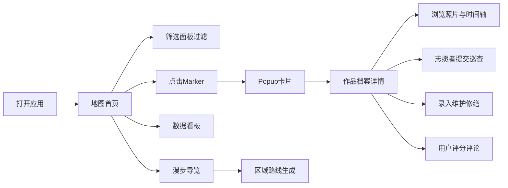

## 1. 产品概述

城市公共艺术装置地图与维护记录系统，基于浏览器IndexedDB本地存储，提供公共艺术作品的发现、档案记录、状态追踪与文化导览功能。

- 面向城市管理部门、巡查志愿者、艺术爱好者与居民用户，解决公共艺术作品信息分散、状态无人追踪、维护记录缺失的问题
- 打造集发现、记录、维护、导览、社区互动于一体的公共艺术数字平台，提升城市文化资产的可视性与管护效率

## 2. 核心功能

### 2.1 用户角色

| 角色 | 使用场景 | 核心权限 |
|------|----------|----------|
| 普通用户/居民 | 浏览地图、查看作品、评分评论、上传偶遇照片、漫步导览 | 浏览、评分、评论、上传补充照片、生成路线 |
| 巡查志愿者 | 定期巡检、状态记录、问题上报 | 记录巡查状态、登记问题、上传现场照片、标记已巡检 |
| 管理者/档案管理员 | 作品建档、维护记录、数据统计 | 新建/编辑作品档案、录入修缮记录、查看数据看板 |

### 2.2 功能模块

1. **地图首页**：Leaflet交互地图、类型分色标记、缩放聚合MarkerCluster、作品弹出卡片、类型/年代/材质筛选
2. **作品档案页**：作品详情、作者年代材质工艺、产权与资金来源、多角度照片画廊、创作故事、公众评价汇总
3. **巡查记录模块**：五级状态登记（完好/轻微/中等/严重/已拆除）、问题标签（涂鸦/锈蚀/松动等）、现场照片、时间轴历史记录、未巡查提醒
4. **维护修缮模块**：修缮记录CRUD、施工单位/费用/前后对比照片、累计费用与频次汇总、耐久性评估辅助
5. **社区互动模块**：评分星级、留言评论、用户偶遇照片上传、浏览量统计、受欢迎作品排行
6. **漫步导览模块**：按区域选择、智能串联沿途作品、路线展示、文化导览说明
7. **数据看板**：总数统计、类型/材质分布饼图、待维护清单、本月巡查覆盖率、区域密度热力图、志愿者贡献排行

### 2.3 页面详情

| 页面名称 | 模块名称 | 功能描述 |
|----------|----------|----------|
| 地图首页 | 顶部导航栏 | Logo、页面切换（地图/档案列表/巡查/维护/看板/漫步）、主题切换 |
| 地图首页 | 筛选面板 | 类型多选、年代区间、材质多选、状态筛选 |
| 地图首页 | 交互地图 | Leaflet底图、分色Marker、Cluster聚合、Popup卡片（名称/作者/缩略图/跳转详情） |
| 作品档案页 | 基本信息卡 | 名称、类型标签、作者、创作年份、材质工艺、产权归属、资金来源 |
| 作品档案页 | 照片画廊 | 多角度照片轮播、铭牌特写、点击放大预览 |
| 作品档案页 | 创作故事 | 富文本展示创作背景与故事 |
| 作品档案页 | 状态时间轴 | 巡查记录纵向时间轴、状态变化趋势标注 |
| 作品档案页 | 维护记录列表 | 修缮记录卡片、费用汇总 |
| 作品档案页 | 评论区 | 星级评分、留言列表、用户照片墙 |
| 巡查管理页 | 作品列表 | 待巡查/已巡查作品列表、最后巡查时间、状态标签 |
| 巡查管理页 | 巡查录入表单 | 五级状态选择、问题标签多选、问题描述、照片上传、志愿者信息 |
| 维护管理页 | 修缮表单 | 日期、修缮类型、施工单位、费用、前后照片、备注 |
| 数据看板 | 统计卡片组 | 作品总数、类型分布、本月巡查数、待维护数、累计维护费用 |
| 数据看板 | 图表区 | 饼图（类型/材质）、柱状图（区域密度）、折线图（月度巡查趋势）、热力图层 |
| 数据看板 | 排行榜 | 受欢迎作品Top10、志愿者贡献排行 |
| 漫步导览页 | 路线生成器 | 区域选择、作品数量选择、生成/重新生成路线按钮 |
| 漫步导览页 | 路线展示 | 地图连线、逐作品卡片区（序号/名称/步行时间）、导出/打印 |

## 3. 核心流程

用户打开应用 → 进入地图首页浏览公共艺术作品分布 → 点击筛选按类型/年代过滤 → 点击Marker查看Popup卡片 → 进入作品档案查看详细信息、照片、历史巡查 → 作为志愿者提交状态巡查记录 → 录入修缮维护信息 → 居民用户评分评论上传偶遇照片 → 管理者在数据看板查看全域统计 → 生成区域漫步路线进行文化导览

## 4. 用户界面设计

### 4.1 设计风格

- 主色调：深青色（Teal）`#0d9488`，辅以琥珀橙`#f59e0b`作为强调色；中性色采用石板灰（Slate）系列
- 按钮风格：圆角`rounded-lg`、主色实心填充，次要按钮描边配hover阴影微动效
- 字体：标题使用「思源黑体/Noto Sans SC」粗体，正文使用系统无衬线字体，字号层次分明（xs-sm-base-lg-xl-2xl）
- 布局：左侧/顶部导航 + 主内容区，卡片式容器配柔和阴影与细微边框
- 图标风格：lucide-react线性图标，尺寸统一20px，配色与上下文联动

### 4.2 页面设计概述

| 页面名称 | 模块名称 | UI元素 |
|----------|----------|--------|
| 地图首页 | 筛选面板 | 顶部折叠条、多Select标签、滑块区间、应用/重置按钮、渐变背景 |
| 地图首页 | 地图区域 | 全屏Leaflet、分色圆形Marker、Cluster聚合数字、Popup卡片带图片缩略图 |
| 作品档案页 | 头图区 | 大幅首图 + 渐变遮罩标题、标签胶囊组、基本信息横向Grid |
| 作品档案页 | 时间轴 | 左侧彩色竖线 + 圆点、状态色对应、卡片hover上浮 |
| 数据看板 | 统计卡片 | 渐变图标圆 + 大数字 + 环比小箭头 + 浅阴影卡片 |
| 数据看板 | 图表容器 | 白底卡片 + 细边框 + 标题栏 + 工具提示 |
| 漫步导览页 | 路线卡片 | 序号圆标 + 作品卡 + 步行箭头 + 总时间 |

### 4.3 响应性

- Desktop-first：1280px以上为双栏/三栏布局，1024px自适应，768px以下切换为单栏堆叠
- 移动端：筛选面板折叠为底部Drawer，地图全宽，卡片紧凑间距减小
- 触摸优化：按钮最小44px，Marker点击区域加大
